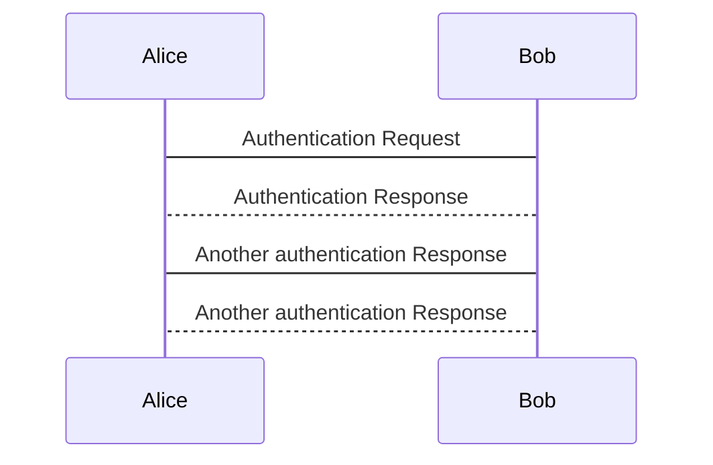

# wiki-sandbox
play around with wiki experiments

```mermaid
  graph TD;
      A-->B;
      A-->C;
      B-->D;
      C-->D;
```

```mermaid
sequenceDiagram
Alice -> Bob: Authentication Request
Bob --> Alice: Authentication Response
Alice -> Bob:Another authentication Response
Bob --> Alice: Another authentication Response
```
