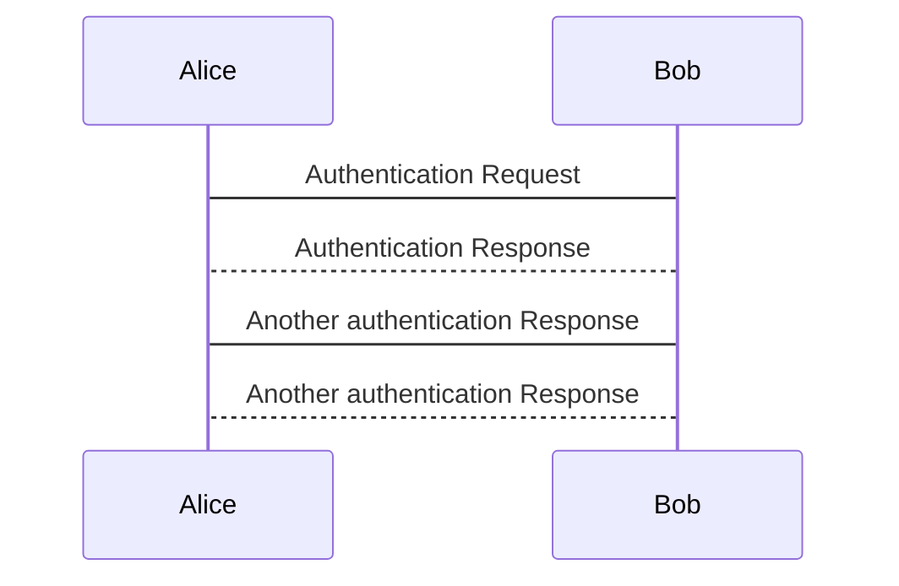

Welcome to the wiki-sandbox wiki!

@startuml
Alice -> Bob: Authentication Request
Bob --> Alice: Authentication Response
Alice -> Bob: Another authentication Request
Alice <-- Bob: another authentication Response
@enduml




<<Note("Did you know?", "bell")>>


```md
<details>
 <summary>Summary Goes Here</summary>
 ...this is hidden, collapsible content...
</details>
```

[GH Pages](https://sputnick1124.github.io/wiki-sandbox/)
I think this may actually work!

Trigger a rebuild
